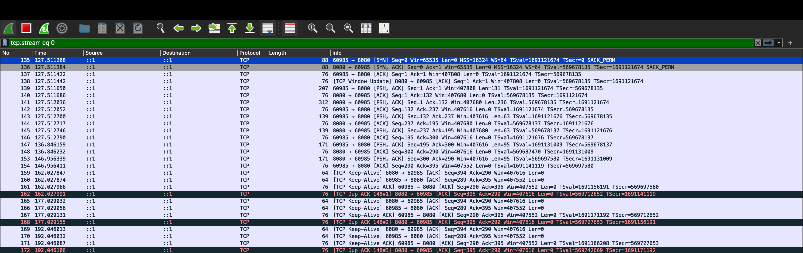

# Crypto Lib

This repository contains a custom cryptographic library implemented from scratch in Go, designed to demonstrate the correctness and soundness of various cryptographic algorithms. The library includes implementations of ECDH25519, ECDSA, AES, HKDF, HMAC, and a custom TLS-like protocol. A simple chat application is used as a testbed to showcase the functionality and security of these algorithms, with verification provided through terminal output and Wireshark packet analysis.

## Features

- **Custom Cryptographic Algorithms**:
  - ECDH25519 for secure key exchange.
  - ECDSA for digital signatures.
  - AES for symmetric encryption.
  - HKDF and HMAC for key derivation and authentication.
- **Custom TLS-like Protocol**: Implements connection, handshake, key scheduling, record layer, and transcript management.
- **Chat Application Testbed**: Demonstrates the library's usage in a client-server chat environment.
- **Verification Tools**: Includes terminal logs and Wireshark captures to prove correctness and soundness.

## Project Structure

```
.
├── asymmetric/              # Asymmetric cryptography
│   ├── ecdh25519/          # ECDH25519 key exchange
│   └── signature/          # ECDSA signatures with test data
├── hash/                   # SHA256 hash implementation with profiling
├── internal/utils/         # Utility functions
├── kdf/                    # Key derivation functions
│   ├── hkdf/              # HKDF implementation
│   └── hmac/              # HMAC implementation
├── protocol/               # Custom protocol implementations
│   ├── chatapp/           # Chat application (client and server)
│   └── TLS/               # Custom TLS-like protocol
├── symmetric/             # Symmetric cryptography
│   ├── aes/              # AES encryption
│   └── classical/        # Additional symmetric algorithms
├── main.go                # Entry point for the chat application
├── README.md              # Project documentation
```

## Prerequisites

- **Go**: Version 1.20 or higher
- **Wireshark**: For analyzing network traffic
- **godotenv**: For environment variable management

  ```bash
  go get github.com/joho/godotenv v1.5.1
  ```
- **Terminal**: For running the client and server
- **Optional**: `bzip2` for extracting signature test data (`SigVer.rsp.bz2`)

## Setup and Running the Chat Application

1. **Clone the Repository**:

   ```bash
   git clone https://github.com/SanthoshCheemala/Crypto.git
   cd Crypto
   ```
2. **Install Dependencies**:

   ```bash
   go mod tidy
   ```
3. **Set Environment Variables**: Configure signing keys in a `.env` file (e.g., `SIGNING_KEY=your_key`).
4. **Run the Server**:

   ```bash
   go run main.go server
   ```
5. **Run the Client** (in a separate terminal):

   ```bash
   go run main.go client
   ```
6. **Send Messages**: Use the client terminal to send messages, which will be encrypted and logged on both client and server.

### Terminal Output Example

Below is a screenshot of the client-server communication, showing the handshake, secure channel establishment, and encrypted message exchange.

## Verifying Correctness and Soundness with Wireshark

This project includes a Wireshark packet capture (`pcap/chat_traffic.pcap`) to demonstrate the cryptographic algorithms' correctness (accurate data transmission) and soundness (security against unauthorized access).

### Steps to Analyze

1. **Install Wireshark**: Download from wireshark.org.
2. **Capture Traffic**:
   - Open Wireshark and select the loopback interface (`lo` on Linux/macOS, `Loopback Adapter` on Windows).
   - Apply the filter `tcp.port == 8080` to focus on the chat application's traffic.
   - Start capturing, send messages, and save as a `.pcap` file (e.g., `chat_traffic.pcap`).
3. **Load Sample Capture**:
   - Open `demo/chat_traffic.pcap` in Wireshark.
   - Observe encrypted payloads in the TCP stream or custom protocol layer.
4. **Verify Properties**:
   - **Correctness**: The handshake (ECDH25519) and encrypted messages (AES) are transmitted accurately.
   - **Soundness**: Only parties with valid keys can decrypt messages, as shown by encrypted data in the capture.
5. **Optional Decryption** (for demonstration only):
   - Use `demo/decryption_keys.txt` to configure Wireshark (`Edit > Preferences > Protocols > TLS`) to decrypt traffic.
   - Decrypted TCP stream confirms message integrity.

### Wireshark Screenshots

- **Communication Flow**: Displays the TCP handshake and encrypted data exchange.

  
- **TCP Stream Data**: Shows encrypted payloads and (optionally) decrypted messages.

  

## Demonstration Video

For a detailed walkthrough of the project, including the chat application and Wireshark analysis, watch the demonstration video here: Google Drive Link

## Testing and Profiling

- **Unit Tests**: Run tests for each module:

  ```bash
  go test ./asymmetric/ecdh25519
  go test ./asymmetric/signature
  go test ./hash
  go test ./kdf/hkdf
  go test ./kdf/hmac
  go test ./symmetric/aes
  ```
- **Profiling**: CPU and memory profiles for SHA256 are in `hash/cpu.prof` and `hash/mem.prof`. Analyze with:

  ```bash
  go tool pprof hash/cpu.prof
  ```

## Security Notes

- This is for demonstration only and should not be used in production.
- Ensure secure key management in real-world applications to prevent exposure.

## TODO

- Planning to Implement RNG & PRNG(Pseudo Random Generater) Functions
- Planning to Implement bilinear Pairing and Signatures using special type of Elliptic Curves(BLS12–381)

## Contributing

Contributions are welcome! Open an issue or submit a pull request with improvements or bug fixes.

## License

This project is licensed under the MIT License. See LICENSE for details.
